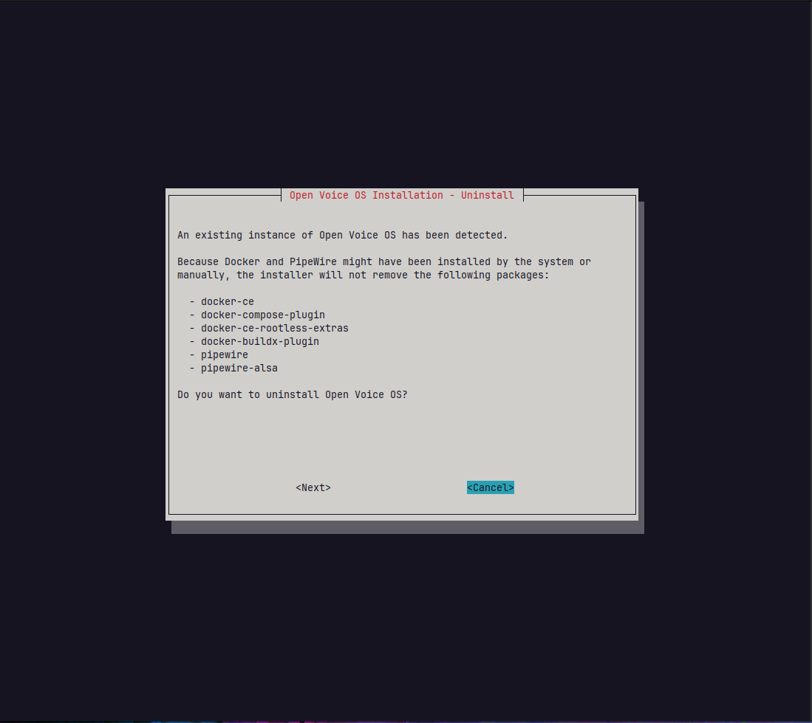

# Open Voice OS and HiveMind Installer

A nice, simple, multilingual and intuitive way to install Open Voice OS and/or HiveMind using Bash, Whiptail _(Newt)_ and Ansible.

## Quickstart

`curl`, `git` and `sudo` packages must be installed before running the installer.

```shell
sh -c "curl -s https://raw.githubusercontent.com/OpenVoiceOS/ovos-installer/main/installer.sh -o installer.sh && chmod +x installer.sh && sudo ./installer.sh && rm installer.sh"
```

Then follow the instructions display on screen.

### Supported Linux distributions

| Distribution        | Version   |
| ------------------- | --------- |
| Arch                | `N/A`     |
| CentOS              | `>= 8`    |
| Debian GNU/Linux    | `>= 10`   |
| EndeavourOS         | `N/A`     |
| Fedora              | `>= 37`   |
| Linux Mint          | `>= 21`   |
| openSUSE Leap       | `>= 15`   |
| openSUSE Tumbleweed | `N/A`     |
| Manjaro             | `N/A`     |
| Raspbian            | `10`      |
| Raspberry Pi OS     | `>= 11`   |
| Rocky Linux         | `>=8`     |
| Ubuntu              | `>=20.04` |
| WSL2                | `N/A`     |

## Update

To update the current Open Voice OS instance, backup your `~/.config/mycroft/mycroft.conf` or `~/ovos/config/mycroft.conf` _(only if required)_ and re-run installer but answer **"No"** to the _"Do you want to uninstall Open Voice OS?"_ question.

## Automated install

The installer supports a non-interactive _(automated)_ process of installation by using a scenario file, this file must be created under the `~/.config/ovos-installer/` directory and should be named `scenario.yaml`.

Here is an example of a scenario to install Open Voice OS within Docker containers on a Raspberry Pi 4B with default skills and GUI support.

```shell
mkdir -p ~/.config/ovos-installer
cat <<EOF > ~/.config/ovos-installer/scenario.yaml
---
uninstall: false
method: containers
channel: development
profile: ovos
features:
  skills: true
  gui: true
rapsberry_pi_tuning: true
share_telemetry: true
EOF
```

Few scenarios are available as example in the [scenarios](https://github.com/OpenVoiceOS/ovos-installer/tree/main/scenarios) directory of this repository.

## Uninstall

To uninstall Open Voice OS run the installer with the `--uninstall` option *(non-interactive)* or simply run the installer and answer **"Yes"** to the _"Do you want to uninstall Open Voice OS?"_ question.

```shell
sh -c "curl -s https://raw.githubusercontent.com/OpenVoiceOS/ovos-installer/main/installer.sh -o installer.sh && chmod +x installer.sh && sudo ./installer.sh --uninstall && rm installer.sh
```


## Screenshots





